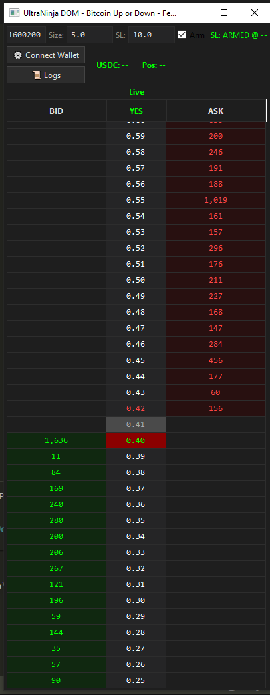
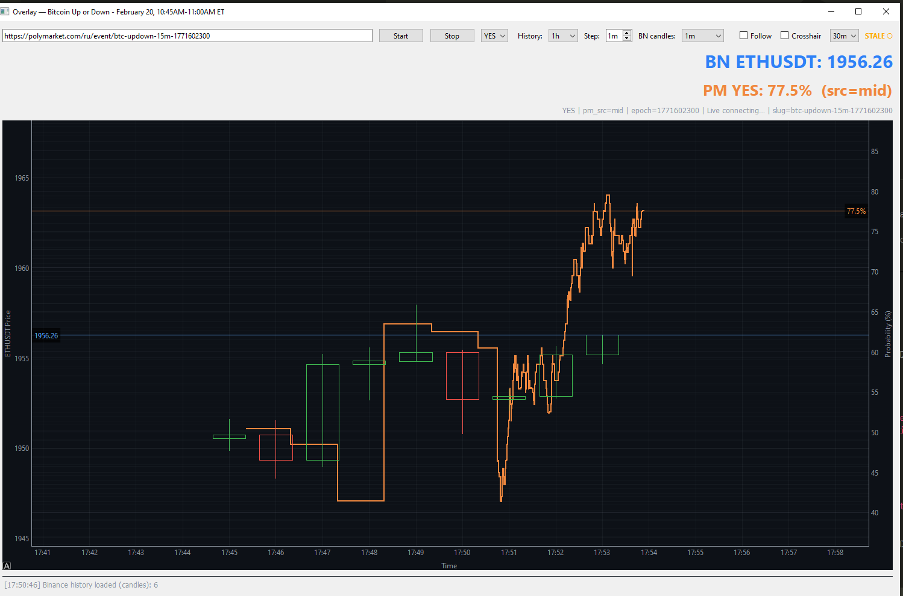

# PolyTrade Terminal - Overview (EN)

## What It Is
PolyTrade Terminal is an AI-oriented terminal for prediction market analysis with an explainable forecast pipeline.

## Current Status
- Stable binary baseline is implemented.
- Phase 2B multi-outcome flow is implemented (contract, consensus, edge, UI, readiness).
- Active development is ongoing.

## What Is Available in Showcase
- Architecture overview: `docs/architecture_en.md`
- Unified taskboard: `docs/Oracle_Insight_Engineering_TaskBoard_MASTER_v3_UNIFIED.docx`
- Usage terms: `docs/NOTICE.md`

## Access Scope
Full core source code is not publicly exposed at this development stage.

